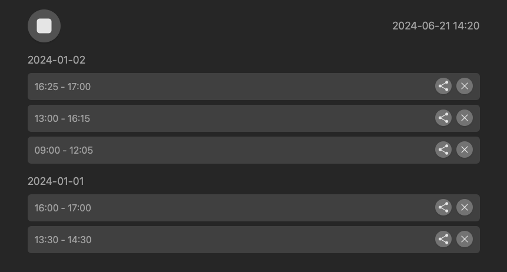

# LittleTrack

> A small time tracking app for when you don't have access to your main time tracking app.

## Features

- Simple tracking of start and end of a time entry
- Persistence: Time entries are saved locally.
- PWA support: The app can be installed on your phone for quick access.
  - Offline use
  - Time entry sharing via the Web Share API (availability depends on the device)

## Features not offered

- Descriptions or tags for time entries
- Synchronization with some kind of online data storage
- Export of time entries, e.g., as a PDF

In general, the idea is that you only use LittleTrack occasionally and transfer the time entries to your main time tracking app regularly.

## Installation as a PWA

Visit the app's URL, and you should see an option to "Add to Home Screen" or an equivalent prompt, depending on your browser. This will install the app on your device, making it accessible just like any other installed app.

## Development

### Prerequisites

- Node.js
- pnpm

### Setup

- Clone the repository to your local machine
- Install the dependencies by running `pnpm install`

### Most important scripts

- `pnpm dev`: Starts the development server on `localhost:5174`.
- `pnpm build`: Builds the app for production
- `pnpm test`: Runs the tests

# Contributing

Contributions are welcome! Please feel free to submit pull requests or open issues to suggest improvements or add new features.

# License

See [here](LICENSE).
